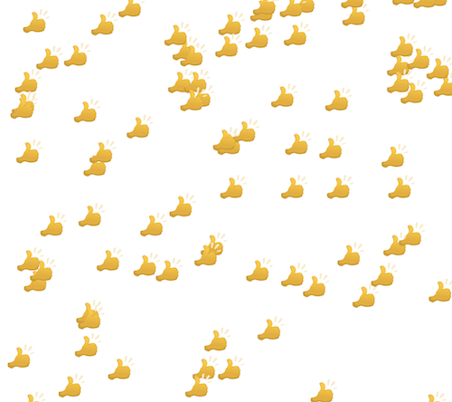

# Mildom Gift Viewer

ゲーム配信サイトである [Mildom](https://www.mildom.com/) の配信者向けのツールです。このツールを配信画面に加えると、視聴者さんがギフトを投げてくれた場合に、画面上にそのギフトの画像を降らせることができます。

**2022/1 に一時期使用できなくなっていましたが、新しい仕様に追従し、再度使用可能になりました。**

# 使い方

はじめに、./js/main.js の中身を編集する必要があります。このファイルをテキストエディタで開いた上で「対象者の Mildom ID」と書かれている行の下の数値を、配信者自身の Mildom ID に変更してください。Mildom ID はユーザーの配信ページの URL の一番最後の数字と一致します。

配信画面に追加するには、OBS の場合は本ツールの browser.html を画面にドラッグ & ドロップで追加できます。画面サイズは配信画面全体にすることをおすすめします。 browser.html が上手く動作しない場合は simple.html を試してみてください。

# 謝辞

本ツールは [developer-kui/HTMLViewer](https://github.com/developer-kui/HTMLViewer) さんを参考に実装しました。 Mildom の配信ツールを初期の段階から充実していただいた kui さんに感謝します。

# 免責事項

本ツールの使用において、自己責任でお願いします。サポートや要望についてはできる範囲で対応します。

# 作者

[うるし|@uakihir0](https://twitter.com/uakihir0)

# ライセンス

MIT
